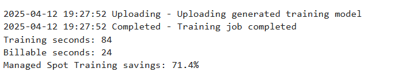
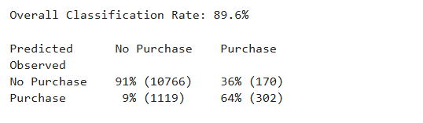
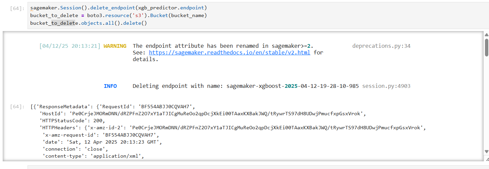

# Bank Application ML Project

## Overview
This project demonstrates how to build, train, and deploy a machine learning model using Amazon SageMaker to predict whether bank customers will subscribe to a term deposit.

### Key Features
- XGBoost classification model
- AWS SageMaker integration
- Cost optimization with spot instances
- 89.7% classification accuracy

---

## Requirements
- AWS Account with SageMaker access
- Python 3.x
- Required libraries: `sagemaker`, `boto3`, `pandas`, `numpy`

## Quick Start
```bash
# Clone the repository
git clone https://github.com/yourusername/bank-application-ml.git

# Install dependencies
pip install -r requirements.txt

# Open the notebook
jupyter notebook notebooks/bank_prediction_model.ipynb
```

---

## Detailed Workflow

### 1. Data Preparation
- Download the bank customer dataset
- Split into training (70%) and testing (30%) sets

### 2. S3 Setup
- Create an S3 bucket for data storage
- Upload training and testing datasets

### 3. Model Training
```python
# Key hyperparameters
hyperparameters = {
    "max_depth": "5",
    "eta": "0.2",
    "gamma": "4",
    "min_child_weight": "6",
    "subsample": "0.7",
    "objective": "binary:logistic",
    "num_round": 50
}
```

### 4. Model Deployment
- Deploy as a real-time endpoint on ml.m4.xlarge instance

### 5. Model Evaluation
#### Performance Metrics
| Metric | Value |
|--------|-------|
| Accuracy | 89.7% |
| True Negative | 10,785 (91%) |
| False Positive | 151 (34%) |
| False Negative | 1,124 (9%) |
| True Positive | 297 (66%) |

### 6. Resource Management
- Endpoint cleanup procedures
- S3 bucket object removal

---

## Project Structure
```
├── notebooks/
│   └── bank_prediction_model.ipynb
├── data/
│   └── bank_clean.csv
├── README.md
└── requirements.txt
```

## Important Notes
⚠️ **Remember to delete endpoints and clean S3 buckets after use to avoid unnecessary AWS charges**

## Advanced Usage
- Modify hyperparameters for performance tuning
- Scale instances for production workloads
- Implement A/B testing with multiple models

---

## Contributing
Contributions are welcome! Please feel free to submit a Pull Request.

---

## Images

<div align="center">
  
  
  <p><em>Figure 1: Training Image</em></p>
</div>

<div align="center">
  
  
  <p><em>Figure 2: Model Performance Metrics</em></p>
</div>

<div align="center">
  
  
  <p><em>Figure 3: Resource Cleanup Process</em></p>
</div>

